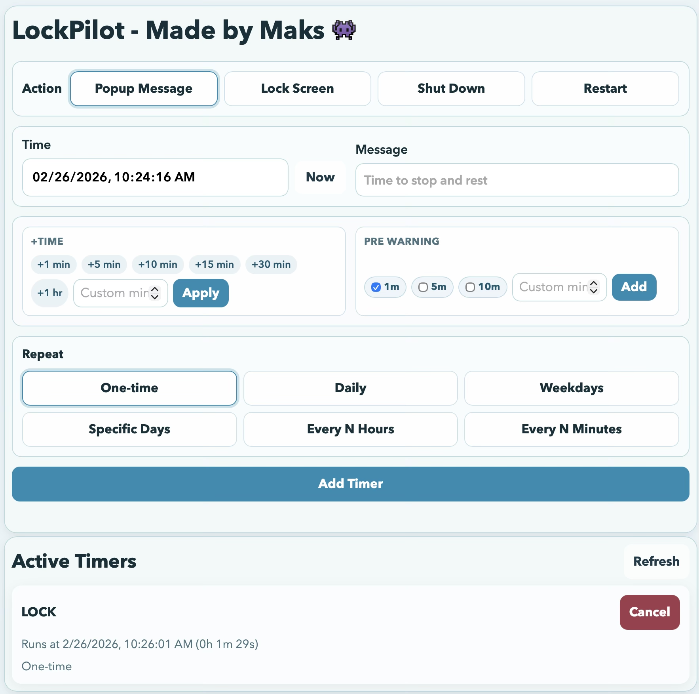

<h1 align="center">LockPilot - Made by Maks 👾</h1>

## [Download for macOS](https://github.com/maxacode/LockPilot-Mac-Win/releases/download/v1.0.2/LockPilot_1.0.2_aarch64.dmg)
## [Download for Windows](https://github.com/maxacode/LockPilot-Mac-Win/releases/download/v1.0.2/LockPilot_1.0.2_x64-setup.exe)

Use the latest GitHub release page above and pick the correct installer:
- macOS: `.dmg`
- Windows: `.exe` / `.msi`

## Features

- One shared UI for both macOS and Windows.
- Actions: `Popup Message`, `Lock Screen`, `Shut Down`, `Restart`.
- One-time and recurring timers: `Daily`, `Weekdays`, `Specific Days`, `Every N Hours`, `Every N Minutes`.
- Fast time controls: `+1 min`, `+5 min`, `+10 min`, `+15 min`, `+30 min`, `+1 hr`, plus custom increment.
- Pre-warning controls: `1`, `5`, `10` minute warnings plus custom input in UI.
- External pre-warning popup before action runs (outside the main app window).
- Live pre-warning countdown until scheduled action time.
- Active timer list with live countdown and quick cancel.
- In-app update checker with channels: `main (stable)` and `dev (prerelease)`.
- In-app install flow for latest channel update.
- Rollback installer picker for older releases.
- Release notes shown in the app for update visibility.

## Update and release flow

- `dev` branch: prerelease/dev builds.
- `main` branch: stable builds.
- Shared UI source lives in `packages/ui`.
- If UI changes, both platforms are built.
- If only one backend changes, only that platform is built.

## Repo layout

- `packages/ui/` -> shared frontend source of truth
- `apps/mac/` -> macOS Tauri app/backend
- `apps/windows/` -> Windows Tauri app/backend
- `.github/workflows/` -> build/release automation
- `release-version.txt` -> release version seed

## Legacy repos

Existing repos remain intact:
- `maxacode/LockPilotMac`
- `maxacode/LockPilot-Windows`
